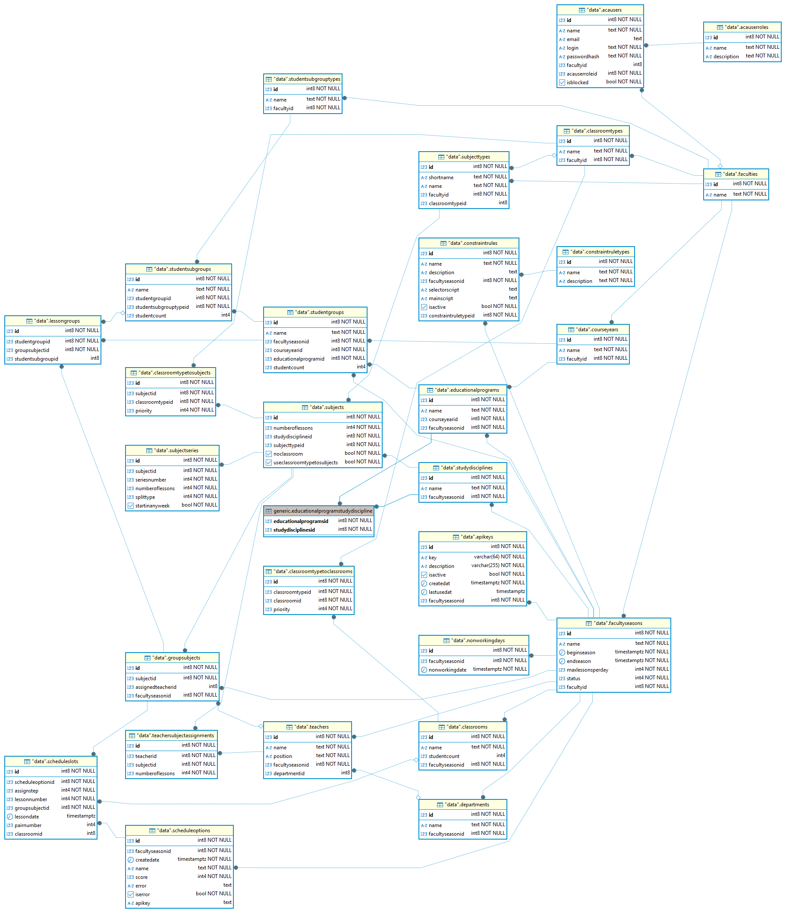

# AcaTime Database Structure

This section describes the main database schema and entity relationships in AcaTime.

## Schema Diagram

## Entity Descriptions

### Faculties and Seasons

- **Faculty** — educational institution faculty
  - `Id` — unique identifier
  - `Name` — unique faculty name
  - `Description`

- **FacultySeason** — faculty academic season
  - `Id`, `Name`, `FacultyId`, `Faculty` (navigation), `Description`

### Student Groups

- **StudentGroup** — student group
  - `Id`, `Name`, `FacultySeasonId`, `CourseYearId`, `StudentSubgroupTypes`

- **StudentSubgroup** — subgroup
  - `Id`, `Name`, `StudentGroupId`, `StudentSubgroupTypeId`

- **StudentSubgroupType** — subgroup type
  - `Id`, `Name`, `FacultyId`, `Description`

- **CourseYear** — year of study
  - `Id`, `Name`, `FacultyId`

### Disciplines and Subjects

- **StudyDiscipline** — study discipline
  - `Id`, `Name`, `Description`, `EducationalProgramId`

- **Subject** — specific subject
  - `Id`, `Name`, `StudyDisciplineId`, `SubjectTypeId`, `Description`, `DurationHours`, `DurationMinutes`

- **SubjectType** — subject type (lecture, practical, etc.)
  - `Id`, `Name`, `FacultyId`, `Description`

- **SubjectSeries** — lesson series for a subject
  - `Id`, `SubjectId`, `SeriesNumber`, `SplitTypeId`

### Teachers and Assignments

- **Teacher**
  - `Id`, `Name`, `Position`, `FacultySeasonId`

- **TeacherSubjectAssignment** — teacher-to-subject assignment
  - `Id`, `TeacherId`, `SubjectId`

- **Department** — academic department
  - `Id`, `Name`, `FacultySeasonId`

### Educational Programs

- **EducationalProgram**
  - `Id`, `Name`, `CourseYearId`, `FacultySeasonId`, `Description`

### Schedule and Lessons

- **GroupSubject** — subject assigned to a group
  - `Id`, `SubjectId`, `TeacherSubjectAssignmentId`, `FacultySeasonId`, `PriorityLevel`, `WeekDay`, `LessonNumber`, `IsManuallyPlaced`

- **LessonGroup** — group/subgroup for a lesson
  - `Id`, `GroupSubjectId`, `StudentGroupId`, `StudentSubgroupId`

- **ScheduleSlot** — a single schedule slot
  - `Id`, `ScheduleOptionId`, `GroupSubjectId`, `WeekDay`, `LessonNumber`, `ClassroomId`, `AssignStep`

- **ScheduleOption** — a schedule variant
  - `Id`, `Name`, `FacultySeasonId`, `Description`, `IsBaseOption`

### Classrooms

- **Classroom**
  - `Id`, `Name`, `FacultySeasonId`, `Capacity`

- **ClassroomType**
  - `Id`, `Name`, `FacultyId`

- **ClassroomTypeToClassroom** — classroom ↔ type link
  - `Id`, `ClassroomTypeId`, `ClassroomId`

- **ClassroomTypeToSubject** — classroom type ↔ subject link
  - `Id`, `ClassroomTypeId`, `SubjectId`

### Users and Access

- **AcaUser**
  - `Id`, `Login` (unique), `PasswordHash`, `Name`, `AcaUserRoleId`, `FacultyId`, `IsBlocked`

- **AcaUserRole**
  - `Id`, `Name`, `Description`

### Constraints and Rules

- **ConstraintRule**
  - `Id`, `Name`, `ConstraintRuleTypeId`, `Description`, `ScriptCode`, `FacultyId`, `Priority`

- **ConstraintRuleType**
  - `Id`, `Name`, `Description`

### Other Entities

- **ApiKey**
  - `Id`, `Key`, `UserId`, `Description`, `Created`, `Expires`, `LastAccess`, `AccessCount`, `IsBlocked`
